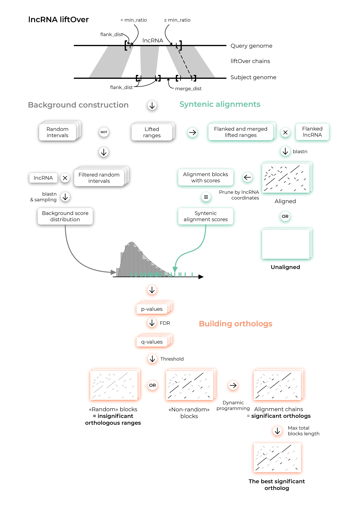
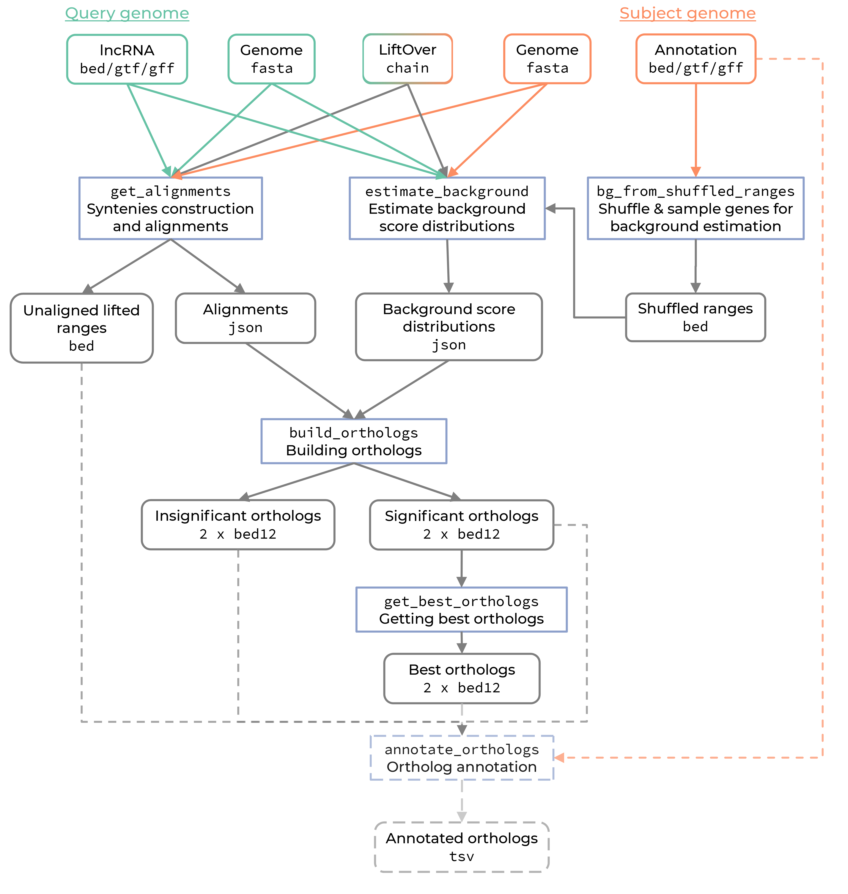

# ortho2align
```ortho2align``` is a lncRNA ortholog discovery CLI tool based on syntenic regions and statistical assessment of alignment nonrandomness.

## What can it be used for?
```ortho2align``` can be used to find orthologs of de novo discovered lncRNAs of one species in another species and additionally anotate found orthologs with given genes of the other species. ```ortho2align``` allows one to control sensitivity and specificity of the procedure.

## How does it work?
The ortho2align pipeline consists of several steps. A graphical description of the algorithm for a single lncRNA is shown below.



### 1. Getting alignments.
First, lncRNAs' coordinates are lifted from the query species to the subject species with liftOver (duplications are allowed, minMatch=0.05 by default).

Next, syntenic regions are constructed from those lifted coordinates. Duplications are merged if they are closer than the specified distance. Constructed syntenies are flanked with a specified number of nts.

Finally, lncRNAs (with flanking regions) are aligned to their syntenic regions with BLASTN with loose parameters (word_size is set to 6 by default) which results in a set of HSPs for every syntenic region for every lncRNA. 

### 2. Estimating background.
To remove spurious HSPs a background distribution of raw HSP scores is constructed for every lncRNA by aligning its sequence to shuffled genomic ranges from the annotation of the subject genome. 

### 3. Filtering HSPs and building orthologs.
Every HSP is assigned with a p-value based on a right-sided test that HSP’s score is so large only for random reasons. P-values are adjusted with FDR Benjamini-Hochberg procedure. Only those HSPs with a q-value less than a specified α value are retained to control the false discovery rate at α% (5% by default). Then retained HSPs are linked via dynamic programming to form alignment chains, one per every syntenic region of every lncRNA. Those chains are deemed as candidate orthologs.

### 4. Selecting the best ortholog for every lncRNA.
Only one ortholog for every lncRNA is selected based on the maximal sum of HSPs lengths that comprise an ortholog in question.

### 5. Annotating orthologs (optional).
Found orthologs can be annotated with a provided annotation of the subject genome.

### Parallelization
The algorithm is highly parallelizable so it will benefit from running on multi-core systems.

# Installation
```ortho2align``` was tested under 64-bit linux. Also, it might work under 64-bit OS-X.
## Dependencies
```ortho2align``` is written in python and needs several python packages and standalone programs to work.

Programs:
- python >=3.7
- ucsc-liftover 377
- blast 2.9.0

Python packages:
- numpy
- pebble
- scipy
- sortedcontainers 2.1.0
- tqdm

## ```conda``` installation
We recommend this way of installation as it automatically provides all required dependencies.

First, create a dedicated ```conda``` environment.
```{bash}
conda create -n orthoenv
conda activate orthoenv
```
Next, install the package into the dedicated environment.
```{bash}
conda install -c dmitrymyl ortho2align
```
## Installation from source
Alternatively, you can install the package from source.

1. Install the following dependencies manually:
    - python >= 3.7
    - ucsc-liftover 377
    - blast 2.9.0
2. Clone this repo onto your machine:
```{bash}
git clone https://github.com/dmitrymyl/ortho2align.git
```
3. Navigate to the cloned repo:
```{bash}
cd ortho2align
```
4. Install the package:
    - with ```pip```:
    ```{bash}
    pip install .
    ```
    - or with ```setuptools```:
    ```{bash}
    python setup.py install
    ```
    All required python packages will be installed automatically.

# Usage
If you installed the package with ```conda```, activate the dedicated environment first:
```{bash}
conda activate orthoenv
```
The package is organised into the set of subcommands. Run ```ortho2ailgn -h``` to see the description of subcommands:

```{bash}
usage: ortho2align [-h] SUBCOMMAND ...

Ortho2align pipeline

optional arguments:
  -h, --help            show this help message and exit

Subcommands:
  SUBCOMMAND
    bg_from_inter_ranges
                        Generate background set of genomic ranges from
                        intergenic ranges.
    bg_from_shuffled_ranges
                        Generate background set of genomic ranges from
                        shuffled ranges.
    estimate_background
                        Estimate background alignment scores.
    get_alignments      Compute orthologous alignments of provided query genes
                        and subject species genome.
    build_orthologs     Asses orthologous alignments based on chosen
                        statistical strategy and build orthologs.
    get_best_orthologs  Select only one ortholog for each query gene based on
                        provided variety of strategies.
    annotate_orthologs  Annotate found orthologs with provided annotation of
                        subject genome lncRNAs.
    run_pipeline        Run the whole pipeline.
```

## Run the whole pipeline
You can run the whole pipeline with a single command ```ortho2align run_pipeline```. CLI arguments are described below. Required arguments are stated without squared braces, whereas optional arguments are enclosed with them.
```{bash}
usage: ortho2align run_pipeline [-h] -query_genes [str] -query_genome [str]
                                -subject_annotation [str] -subject_genome
                                [str] [-query_name_regex [str]]
                                [-subject_name_regex [str]] -liftover_chains
                                [str] -outdir [str] [-cores [int]]
                                [-word_size [int]] [-seed [int]] [--silent]
                                [--annotate] [-sample_size [int]]
                                [-observations [int]] [-min_ratio [float]]
                                [-merge_dist [int]] [-flank_dist [int]]
                                [-fitting [{kde,hist}]] [-threshold [float]]
                                [--fdr] [-timeout [int]]
                                [-value [{total_length,block_count,block_length,weight}]]
                                [-function [{max,min}]]

Run the whole pipeline.

optional arguments:
  -h, --help            show this help message and exit

Input:
  -query_genes [str]    query genomic ranges.
  -query_genome [str]   Query species genome filename (fasta format).
  -subject_annotation [str]
                        subject species genome annotation for construction of
                        background genomic ranges.
  -subject_genome [str]
                        Subject species genome filename (fasta format).
  -query_name_regex [str]
                        Regular expression for extracting gene names from the
                        query genes annotation (.gff and .gtf only). Must
                        contain one catching group (default: None).
  -subject_name_regex [str]
                        Regular expression for extracting gene names from the
                        subject genome annotation (.gff and .gtf only). Must
                        contain one catching group (default: None).
  -liftover_chains [str]
                        liftover .chain filename

Output:
  -outdir [str]         output directory name.

Processing:
  -cores [int]          Number of cores to use for multiprocessing (default:
                        1).
  -word_size [int]      -word_size argument to use in blastn search (default:
                        6).
  -seed [int]           random seed for sampling procedures (default: 0).
  --silent              silent CLI if included (default: False).
  --annotate            If included, will annotate found orthologs with
                        subject annotation (default: False).

Estimating background:
  -sample_size [int]    Number of background regions to generate (default:
                        200).
  -observations [int]   maximum number of background scores to retain for each
                        query gene.

Getting alignments:
  -min_ratio [float]    minimal ratio of gene overlapping liftover chain to
                        consider it for liftover (default: 0.05).
  -merge_dist [int]     how distant two subject syntenies can be to be merged
                        into one syntenic region (default: 2000000).
  -flank_dist [int]     how many nts to flank syntenic regions in subject
                        species (default: 50000).

Building orthologs:
  -fitting [{kde,hist}]
                        approach to fit background distribution (kde: KDE,
                        hist: Histogram) (default: kde).
  -threshold [float]    p-value threshold to filter HSPs by score (default:
                        0.05).
  --fdr                 use FDR correction for HSP scores if included
                        (default: False).
  -timeout [int]        Time in seconds to terminate a single process of
                        refinement of a single alignment. If None, then no
                        time limit is imposed (default: None).

Getting best orthologs:
  -value [{total_length,block_count,block_length,weight}]
                        which value of orthologs to use in case of multiple
                        orthologs (default: block_length).
  -function [{max,min}]
                        orthologs with which value to select in case of
                        multiple orthologs (default: max).
```
### Input and output files
```ortho2align``` takes these files as input:
1. lncRNA annotation of the query species in ```bed/gtf/gff``` formats;
2. Query species genome in ```fasta``` format;
3. Subject species genome in ```fasta``` format;
4. liftOver ```chain``` file from query to subject species;
5. Subject species gene annotation in ```bed/gtf/gff``` formats.

```ortho2align``` produces a directory with intermediate and output files. The main outputs are:
1. ```best.query_orthologs.bed```: coordinates of alignment blocks of lncRNAs in query species with found orthologs in subject species in ```bed12``` format.
2. ```best.subject_orthologs.bed```: coordinates of alignment blocks of found orthologs in subject species in ```bed12``` format.
3. ```stats.txt```: plain text file with statistics describing every pipeline step.
4. ```best.ortholog_annotation.tsv``` (optional): plain table with a header and two columns that matches query lncRNAs names with subject species gene names that overlap lncRNAs orthologs.

A principal structure of the output directory is shown below:
```
outdir/
├─ best.ortholog_annotation.tsv
├─ best.query_orthologs.bed
├─ best.subject_orthologs.bed
├─ shuffle_bg.bed
├─ stats.txt
├─ the_map.json
├─ align_files/
│  ├─ exceptions.bed
│  ├─ unalignable.bed
│  ├─ rna1.json
│  ├─ rna2.json
│  ├─ ...
├─ bg_files/
│  ├─ exceptions.bed
│  ├─ rna1.json
│  ├─ rna2.json
│  ├─ ...
├─ build_files/
   ├─ subject_exceptions.bed
   ├─ query_exceptions.bed
   ├─ subject_orthologs.bed
   ├─ query_orthologs.bed
```
## Run every step separately
Alternatively you can run each step separately in case you want to try different parameter values for each step. The pipeline above is combined from these step as shown in the scheme below:


### Constructing background ranges
Background genomic ranges of the subject genome are constructed as a sample of shuffled genes from the annotation of the subject genome with ```ortho2align bg_from_shuffled_ranges```.
```{bash}
usage: ortho2align bg_from_shuffled_ranges [-h] -genes [str] -genome [str]
                                           [-name_regex [str]] -sample_size
                                           [int] [-seed [int]] -output [str]

Generate background set of genomic ranges from intergenic ranges.

optional arguments:
  -h, --help          show this help message and exit

Input:
  -genes [str]        Gene annotation filename to use for composing shuffled
                      ranges.
  -genome [str]       Genome file for checking of chromosome sizes.
  -name_regex [str]   Regular expression for extracting gene names from the
                      genes annotation (.gff and .gtf only). Must contain one
                      catching group (default: None).

Processing:
  -sample_size [int]  Number of background regions to generate.
  -seed [int]         random seed number for sampling intergenic regions
                      (default: 123).

Output:
  -output [str]       Output filename for background regions annotation in
                      bed6 format.
```
### Estimating background
Estimation of the background distribution of HSP scores for every lncRNA is done with ```ortho2align estimate_background```.
```{bash}
usage: ortho2align estimate_background [-h] -query_genes [str] -bg_ranges
                                       [str] -query_genome [str]
                                       -subject_genome [str]
                                       [-query_name_regex [str]]
                                       [-bg_name_regex [str]]
                                       [-word_size [int]]
                                       [-observations [int]] -outdir [str]
                                       [-cores [int]] [-seed [int]] [--silent]

Estimate background alignment scores.

optional arguments:
  -h, --help            show this help message and exit

Input:
  -query_genes [str]    Query species gene annotation filename.
  -bg_ranges [str]      Background genomic range set of subject species.
  -query_genome [str]   Query species genome filename (fasta format).
  -subject_genome [str]
                        Subject species genome filename (fasta format).
  -query_name_regex [str]
                        Regular expression for extracting gene names from the
                        query genes annotation (.gff and .gtf only). Must
                        contain one catching group (default: None).
  -bg_name_regex [str]  Regular expression for extracting gene names from the
                        background ranges annotation (.gff and .gtf only).
                        Must contain one catching group (default: None).

Parameters:
  -word_size [int]      -word_size argument to use in blastn search (default:
                        6).
  -observations [int]   number of scores to retain for each query gene
                        (default: 1000).

Output:
  -outdir [str]         Output directory name for background files.

Processing:
  -cores [int]          Number of cores to use for alignment multiprocessing
                        (default: 1).
  -seed [int]           random seed for sampling scores (default: 123).
  --silent              silent CLI if included (default: False).
```
### Getting alignments
Alignment step is done with ```ortho2align get_alignments```.
```{bash}
usage: ortho2align get_alignments [-h] -query_genes [str] -query_genome [str]
                                  -subject_genome [str]
                                  [-query_name_regex [str]] -liftover_chains
                                  [str] [-min_ratio [float]]
                                  [-word_size [int]] [-merge_dist [int]]
                                  [-flank_dist [int]] -outdir [str]
                                  [-cores [int]] [--silent]

Compute orthologous alignments of provided query genes and subject species
genome.

optional arguments:
  -h, --help            show this help message and exit

Input:
  -query_genes [str]    query genes annotation filename
  -query_genome [str]   query species genome filename (fasta)
  -subject_genome [str]
                        subject genome filename (fasta)
  -query_name_regex [str]
                        Regular expression for extracting gene names from the
                        query genes annotation (.gff and .gtf only). Must
                        contain one catching group (default: None).
  -liftover_chains [str]
                        liftover .chain filename

Parameters:
  -min_ratio [float]    minimal ratio of gene overlapping liftover chain to
                        consider it for liftover (default: 0.05).
  -word_size [int]      -word_size parameter to use in blastn (default: 6).
  -merge_dist [int]     how distant two subject syntenies can be to be merged
                        into one syntenic region (default: 2000000).
  -flank_dist [int]     how many nts to flank syntenic regions in subject
                        species (default: 50000).

Output:
  -outdir [str]         output directory name

Processing:
  -cores [int]          Number of cores to use for alignment multiprocessing
                        (default: 1).
  --silent              silent CLI if included (default: False).
```
### Building orthologs
Filtering of HSPs and construction of orthologs is done with ```ortho2align build_orhtologs```.
```{bash}
usage: ortho2align build_orthologs [-h] -alignments [str] -background [str]
                                   [-fitting [{kde,hist}]]
                                   [-threshold [float]] [--fdr] -outdir [str]
                                   [-cores [int]] [-timeout [int]] [--silent]

Asses orthologous alignments based on chosen statistical strategy and build
orthologs.

optional arguments:
  -h, --help            show this help message and exit

Input:
  -alignments [str]     Alignments dir produced with ortho2align
                        get_alignments.
  -background [str]     background dir produced with ortho2align
                        estimate_background.

Parameters:
  -fitting [{kde,hist}]
                        approach to fit background distribution (kde: KDE,
                        hist: Histogram) (default: kde).
  -threshold [float]    p-value threshold to filter HSPs by score (default:
                        0.05).
  --fdr                 use FDR correction for HSP scores (default: False).

Output:
  -outdir [str]         output directory.

Processing:
  -cores [int]          Number of cores to use for refinement multiprocessing
                        (default: 1).
  -timeout [int]        Time in seconds to terminate a single process of
                        refinement of a single alignment. If None, then no
                        time limit is imposed (default: None).
  --silent              silent CLI if included (default: False).
```
### Getting best orthologs
The best orthologs are selected with ```orhto2align get_best_orthologs```.
```{bash}
usage: ortho2align get_best_orthologs [-h] -query_orthologs [str]
                                      -subject_orthologs [str]
                                      [-value [{total_length,block_count,block_length,weight}]]
                                      [-function [{max,min}]] -outfile_query
                                      [str] -outfile_subject [str]
                                      -outfile_map [str]

Select only one ortholog for each query gene based on provided variety of
strategies.

optional arguments:
  -h, --help            show this help message and exit

Input:
  -query_orthologs [str]
                        query orthologs bed12 file.
  -subject_orthologs [str]
                        subject orthologs bed12 file.

Parameters:
  -value [{total_length,block_count,block_length,weight}]
                        which value of orthologs to use in case of multiple
                        orthologs (default: block_length).
  -function [{max,min}]
                        orthologs with which value to select in case of
                        multiple orthologs (default: max).

Output:
  -outfile_query [str]  output filename for query orthologs.
  -outfile_subject [str]
                        output filename for subject orthologs.
  -outfile_map [str]    output json filename for mapping of query and subject
                        ortholog names.
```
### Annotating orthologs (optional)
Ortholog annotation is done with ```ortho2align annotate_orthologs```.
```{bash}
usage: ortho2align annotate_orthologs [-h] -subject_orthologs [str]
                                      -subject_annotation [str]
                                      [-subject_name_regex [str]] -output
                                      [str]

Annotate found orthologs with provided annotation of subject genome lncRNAs.

optional arguments:
  -h, --help            show this help message and exit

Input:
  -subject_orthologs [str]
                        subject orthologs filename generated with
                        get_best_orthologs.
  -subject_annotation [str]
                        subject genome lncRNA annotation filename.
  -subject_name_regex [str]
                        Regular expression for extracting gene names from the
                        subject genome lncRNA annotation (.gff and .gtf only).
                        Must contain one catching group (default: None).

Output:
  -output [str]         output filename.
```
## ```config``` files for CLI arguments
Instead of entering each CLI argument for every subcommand, a ```.config``` file with CLI arguments can be supplied via ```ortho2align @subcommand.config```. The first line of the file is the name of the subcommand, next lines contain argument names and their values one by one. Check [configs](./configs) directory for sample ```.config``` files.
# Testing
You can test the installed package, whether it works or not. After the package is installed (and the environment activated, if needed), run the commands below:
```{bash}
wget https://github.com/dmitrymyl/ortho2align/releases/download/v0.9/test.tar.gz
tar -xzvf test.tar.gz
cd test
bash test.sh
```
This will download an archive with test files (see [test](./test)). The test set of RNAs are 96 strRNAs from [here](https://www.sciencedirect.com/science/article/pii/S1097276518307019). The main script [test.sh](./test/test.sh) will download genome and annotation files (2 Gb), which will take some time. You will need nearly 7 Gb of free space for unpacked files. After that, ```ortho2align``` will be run on the test data. If installation was correct, you won't encounter any problems and get a full output in the ```result``` directory.